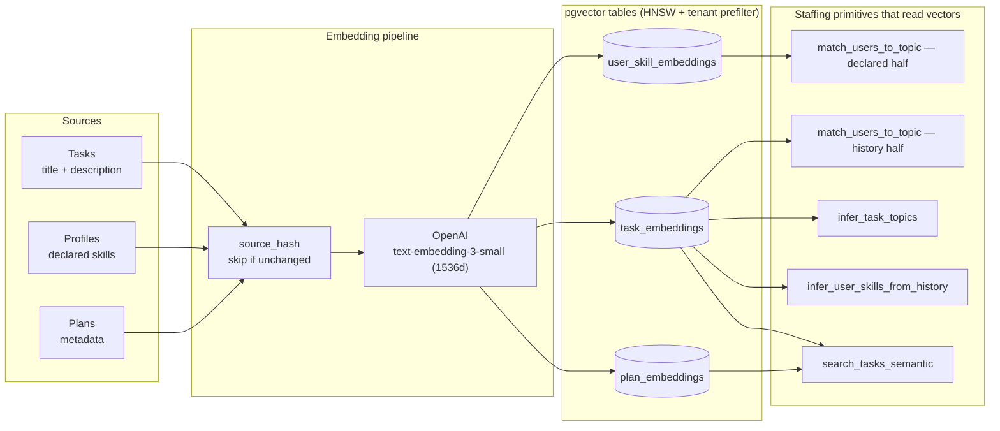
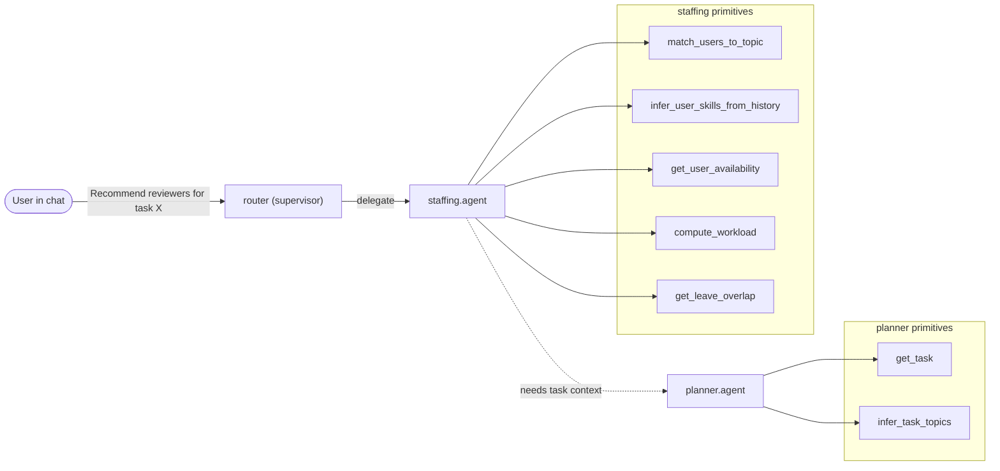
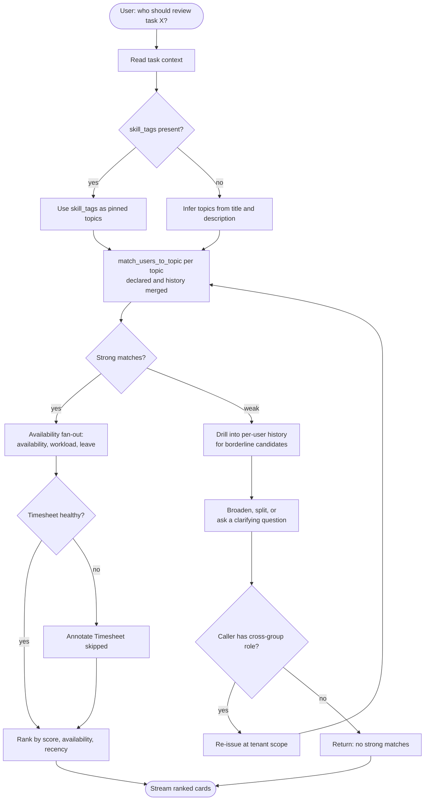
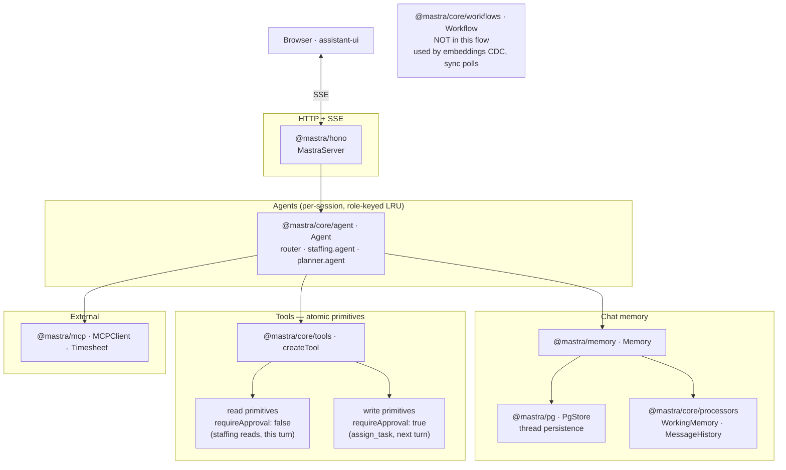
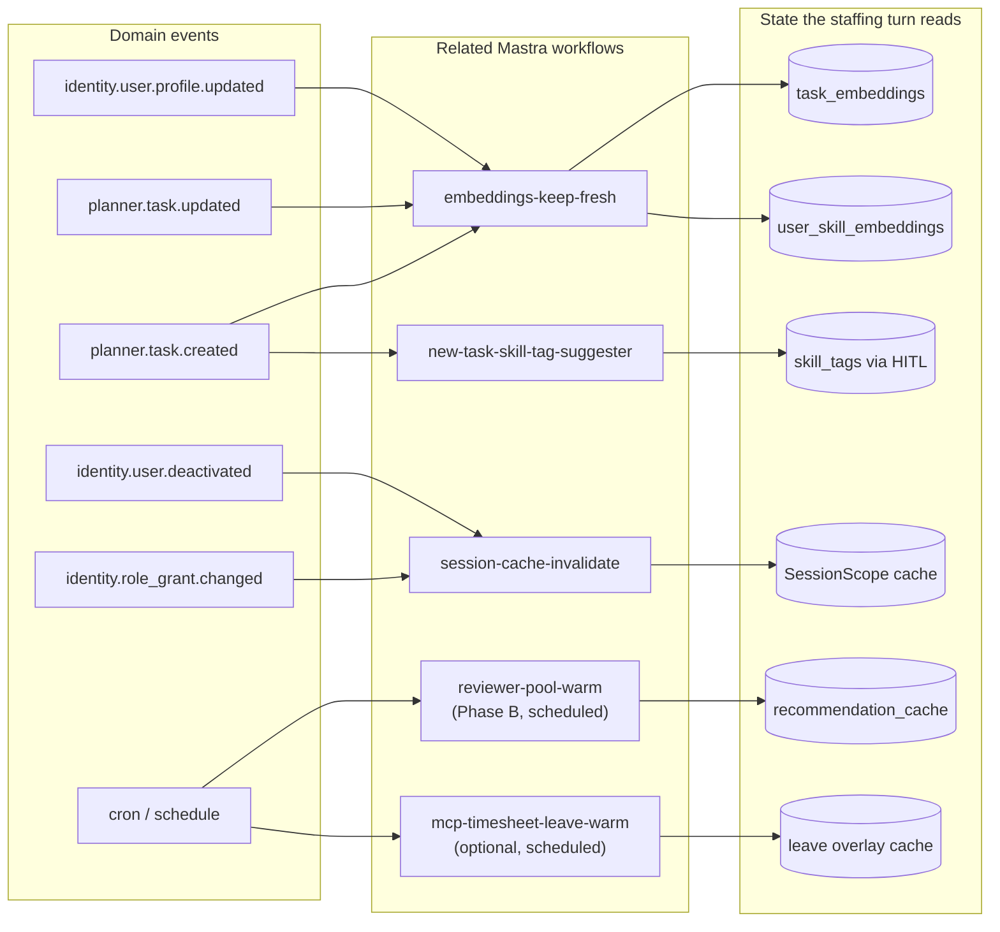

# Use case — Finding staff for a task

## 1. The problem

A user, mid-conversation with the Seta Copilot, points at a task and asks
who should pick it up. The agent must return a short ranked list of
candidates with a one-line reason each — what they're good at, what they've
worked on recently, whether they look available — and the user assigns
manually.

The hard part is rarely "match the skill name to the topic". The hard parts
are everywhere else:

- Most tasks have no manual skill tags. The task is a free-text title and a
  free-text description.
- Most user profiles are short, stale, aggressively broad, or empty.
- The same concept appears under many names ("k8s", "kubernetes",
  "container orchestration", "helm rollout").
- People change roles. Yesterday's terraform expert is today's PM.
- External systems (timesheet, HR) disagree with the platform's own data.
- Sometimes there are no good candidates at all.

The flow has to produce a useful answer when the data is messy, and stay
honest when it can't.

## 2. What "one good answer" looks like

- A ranked list of users from the requester's accessible groups (or the
  whole tenant if they hold a cross-group role).
- Per-candidate rationale that names *why* they were picked and *whether
  they look available*.
- Honest gaps: when a signal was missing or external data was unavailable,
  the rationale says so instead of pretending.
- No writes. Recommendation is read-only. The eventual assignment is a
  separate, approval-gated turn.

## 3. The two signals and the merge

Matching runs on two parallel signals, both stored as vector embeddings:

- **Declared skills.** What the user (or HR) put on their profile.
  Authoritative when fresh; stale when not.
- **Assignment history.** What the user has actually been working on
  recently. Captured by embedding each task's title + description and
  clustering them per user.

For any given topic the system runs both halves in vector space and merges
per-user as `max(declared_match, history_match)`. The result row carries a
`source` flag: `declared`, `history`, or `both`. The merge is the central
business decision:

- *declared-only* would hide newly-hired or under-declared people and let
  stale profiles dominate.
- *history-only* would have nothing to say about technologies the team has
  never used before.
- *the merge* means a user who declared `kafka` but never worked on it is
  still reachable, a user who worked on three kafka-shaped tasks but
  never updated their profile is also reachable, and someone who's done
  both ranks at the top.

Embedding space carries the synonyms. "Infra", "terraform", "kubernetes",
"helm rollout" all sit near each other. There is no curated synonym map
and no manual taxonomy — they were tried in early drafts and rejected as a
maintenance burden that adds little over what the embedding model already
encodes. If a user types "set up the cluster", users who declared
`kubernetes` surface even with no literal token in common.

## 4. Embedding and vector layer

Matching runs on **dense vectors**, not on string equality or curated
taxonomies. Three pieces of platform content are embedded and indexed in
`pgvector`; the staffing primitives query those vectors with cosine
similarity, with a tenant-id prefilter so per-tenant queries never see
other tenants' rows.

| What gets embedded | Vector table | (Re)computed when |
|---|---|---|
| Task `title + description`, chunked when long | `planner.task_embeddings` | Task created or updated |
| Each user's declared skill text | `identity.user_skill_embeddings` | Profile updated |
| Plan metadata (scope helper for task search) | `planner.plan_embeddings` | Plan created |

Embedding model: OpenAI `text-embedding-3-small` (1536 dimensions).
Vectors are HNSW-indexed for sub-100ms top-k queries even at tens of
thousands of vectors per tenant.

The business reason this layer exists: **the embedding model is the
synonym layer.** "Kubernetes", "k8s deploy", "container orchestration",
and "helm rollout" sit near each other in 1536-dimensional space without
anyone authoring a synonym table. A user who declared `kubernetes`
matches a task titled "set up the cluster" because the model already
encodes that relationship — and the platform inherits it for free. The
trade-off is that the matching *language* only evolves when the
embedding model is upgraded (Phase C `embedding-quality-canary` runs the
recipe against historical assignments to catch drift).

**Freshness contract.** Vectors are upserted on a sub-minute lag by the
`embeddings-keep-fresh` workflow (§9). Typical end-to-end is under one
second; the 60-second budget gives headroom for embedding-API hiccups.
A just-created task whose vector hasn't landed yet falls back to an
inline embed-once path within the turn (see §7.1, cold-start row).

## 5. The agents

Three agents in this flow. Each owns one domain and exposes a small tool
list — large tool catalogues hurt model tool-selection quality and inflate
prompt cost.

- **`router`** picks a specialist. For "who should do this" it delegates to
  the staffing agent.
- **`staffing.agent`** owns matching, availability, workload, and leave.
- **`planner.agent`** owns task content — read the task, infer its topics.
  The staffing agent calls into it when it needs the task in front of it.

The primitives are *atomic*. There is no `recommend_reviewers` macro that
bundles the recipe into one tool. The LLM composes primitives per turn,
which is what makes refinements ("ignore workload", "only seniors", "rank
by recent activity") possible without a new tool for every variation.

## 6. The reasoning loop

The recipe below is *illustrative*. The LLM decides what to call next
based on what the previous call returned. The shape that emerges in
practice:

The interesting parts are not the happy path — they're the branches the
agent takes when signals are weak, conflicting, or wrong. The next section
catalogues those.

## 7. Edge cases and how the design responds

Each row pairs a real problem with the design choice that handles it. The
recurring pattern: the agent does not invent missing data and does not
reconcile conflicting data — it surfaces what it found, names what it
didn't, and lets the requester judge.

### 7.1 Weak or missing signal

| Problem | Design response |
|---|---|
| Nobody has declared the matching skill | History half of the merge surfaces users who've worked on related content (e.g. a "fix pubsub backlog" task ranks for a `kafka` query). Rationale flags `source: history` so the requester sees it's an inferred match. |
| Brand-new tenant — no history yet | Agent reports which signal is absent: *"declared profiles only; history index still warming up"*. Does not return silent empty. |
| Brand-new user — no profile, no history | User does not appear in results. Agent does not invent signal. If the requester explicitly asks "include new joiners", the agent says no primitive supports that. |
| Newly-created task — embedding not yet upserted | Inline embed-once for the topic string within the turn. Matching still works; no user-visible failure. |
| Task description is gibberish, templated, or mostly a URL and stack trace | Embedding clusters nowhere useful; topic confidence stays below threshold; agent asks for clarification instead of guessing. |
| Cross-language task vs declared skills | Cross-language similarity is degraded but non-zero. Threshold is shared, so multilingual tenants see more "clarify" turns and fewer auto-confident matches. Intended graceful degradation. |

### 7.2 Conflicting or stale signals

| Problem | Design response |
|---|---|
| User declared `python` years ago, history is now all `terraform` | `max(declared, history)` per topic still surfaces both. Rationale lists both sources: *"matches `aws` via 3 recent tasks; also declares `python` (not relevant here)"*. Staleness is visible, not hidden. |
| User changed roles — old SRE, now PM | History is recency-weighted. `90d` drill-down sharpens the score when role change is suspected. Rationale always shows the date span of the evidence tasks. |
| Self-reported status "available" but computed workload is 8.0 | Both shown side by side in the rationale. Agent does not pick one as the truth. |
| Timesheet email differs from identity email | `get_leave_overlap` returns `source: none`. Rationale says *"could not verify leave"*, never *"not on leave"*. |
| `ooo_until` was set years ago and never cleared | Date appears verbatim in the rationale. Requester spots the staleness; agent does not silently override. |
| Duplicate accounts after SSO migration | System does not auto-merge. Card disambiguates by group membership and email domain. Real fix is admin-side identity merge. |

### 7.3 Noisy or biased data

| Problem | Design response |
|---|---|
| Kitchen-sink declared profile (50 skills) | Compact-text embedding dilutes per-topic similarity — long profiles score *lower* per topic, not higher. History half decides whether the declaration is real. |
| Polluted assignment history (assigned but never worked) | Match uses content cluster centre, not assignment counts. One stray assignment barely moves the cluster. Completion state weights the signal — quickly-reassigned tasks count as noise. |
| Compound declared skill (`AWS` covers EC2, S3, IAM, ...) | Vendor-level declarations sit equidistant from sub-topics in vector space. IAM-specific declarers outrank AWS-broad ones for an IAM topic, but the broad declarer still appears with rationale: *"declared `AWS` — broad signal"*. |
| Workload 5.0 = 1×P0 due tomorrow vs 10×P3 due Q3 — same score, very different "feel" | Primitive returns score *plus* per-factor breakdown. Rationale surfaces composition when top candidates tie: *"1 P0 due tomorrow (high attention demand)"* vs *"10 P3s due Q3 (high count, low urgency)"*. |
| User has 8 tasks all `blocked` | v1 default counts blocked tasks at full weight. Tenant-configurable. Agent does not invent a blocked-state discount on the fly. |

### 7.4 User and flow edges

| Problem | Design response |
|---|---|
| All strong matches are unavailable | Show them anyway with availability annotations. Offer the user three branches: wait, accept a weaker match, or widen scope. Don't silently hide. |
| Requester is themselves the top match | Excluded by default. Mentioned in rationale if they'd have ranked in the top 3. Included when the question is *"who could pair with me?"* — the signal comes from the phrasing. |
| User refines mid-turn ("exclude Alice, only seniors") | Incremental re-composition over the existing tool results — not a restart. If a filter needs a signal not yet fetched, the agent fetches just that for the candidates still in the running. |
| Filter the agent has no primitive for ("exclude people who report to me") | Agent declines and explains. Does not approximate a filter it can't actually enforce. |
| Cross-group expansion | Opt-in, only for cross-group roles. Agent asks before widening: *"you have `org.viewer` — want me to search the whole tenant?"*. No silent scope creep. |
| State drift between recommend and assign — workload changed, task already assigned | The recommendation snapshot is not held. `assign_task` re-validates against current state; the approval card surfaces the drift before the write commits. |
| Sensitive topic ("who has handled layoffs") | No morality filter at the LLM layer. Audit, RBAC, and per-tenant wrappers carry the weight. Refusing would be theatre — the same user can read assignment history in the planner UI. |

### 7.5 System and model edges

| Problem | Design response |
|---|---|
| Timesheet MCP down (500ms timeout) | Returns `degraded: true`. Agent ranks anyway; rationale carries *"Timesheet check skipped"* per candidate. Better than blocking on an external system's downtime. |
| Embedding API rate-limited mid-turn | Agent reports partial state: *"matched on declared skills, history was rate-limited — retry in a few seconds, or rank with declared-only?"* |
| Model invents a candidate name in prose | Output cards are structured. `user_id` must trace to a tool result *in this turn*; phantom IDs are rejected by the wrapper. Audit trail links each card to the tool call that produced it. |
| Model picks the wrong delegate (asks planner instead of staffing) | Router prompt is short and explicit. Misdelegation shows up in the trace; specialist agents either answer (if they can) or hand back. |
| Provider returns a malformed tool call | One retry; on second failure, surfaced as an error card in the stream. No silent swallow. |

## 8. Mastra building blocks

The flow uses these packages from the Mastra stack. Imports follow current
Mastra (subpath imports under `@mastra/core/...`, separate packages for
storage / memory / MCP / HTTP adapter).

| Package | Used for | Role in this flow |
|---|---|---|
| `@mastra/core/agent` (`Agent`) | `router`, `staffing.agent`, `planner.agent` | Per-session agent instances; system prompt + role-filtered tool list |
| `@mastra/core/tools` (`createTool`) | Wrapper for every atomic primitive | `requireApproval: true` is the HITL flag — write tools pause the stream and surface a confirmation card; reads execute directly |
| `@mastra/memory` (`Memory`) | Thread + working-memory storage for chat | `resource = user.id`, `thread = chat thread`; carries multi-turn refinement (§7.4) without re-fetching tool results |
| `@mastra/pg` (`PgStore`, `PgVector`) | Postgres-backed `Memory` storage | Threads in `PgStore`; v1 also reuses the platform's existing pgvector tables (`user_skill_embeddings`, `task_embeddings`) for matching — see §3 |
| `@mastra/core/processors` (`WorkingMemory`, `MessageHistory`) | Compaction when a thread grows past the model context window | Older turns summarised; tool results from the *current* turn stay verbatim so refinements still have the candidate list |
| `@mastra/mcp` (`MCPClient`) | External Timesheet integration | Backs `get_leave_overlap`; 500ms timeout + graceful degradation per §7.5 |
| `@mastra/hono` (`MastraServer`) | HTTP / SSE mount under the platform's Hono app | One endpoint per agent key; the supervisor's stream is the single SSE the browser sees |
| `@mastra/core/workflows` (`Workflow`) | **Not used in this flow** | Workflows are for deterministic step graphs (embeddings refresh, sync polls). This recommendation flow is adaptive reasoning — agent + tools, not a workflow. |

Two design choices in how the platform uses these blocks:

- **Per-session `Agent` instances, keyed by role shape.** Two callers with
  identical permissions share one cached `Agent` instance, which means
  they share the same system prompt, which means upstream provider prompt
  caches hit. Per-user state (name, current task, thread context) flows
  through the message stream, not the system prompt, so the cache key
  stays stable across users.
- **`requireApproval: true` is set on write tools only.** None of the
  staffing primitives in §7 set it — the whole recommendation flow is
  read-only. The next turn's `assign_task` (on the planner agent) is
  where the approval card surfaces.

## 9. Related workflows

The chat turn is read-only and adaptive. But the data it reads (embeddings,
skill tags, session permissions, optionally leave overlays) has to be kept
current by deterministic background pipelines. Those pipelines are Mastra
**Workflows** — distinct from the agent — and they share the same event
bus the platform uses everywhere else (domain events committed in the
same transaction as the state change, dispatched to subscribers).

| Workflow | Trigger | What it does | Why staffing cares |
|---|---|---|---|
| `embeddings-keep-fresh` | Task or profile change events | Computes a `source_hash` over the new content; if changed, enqueues an embedding job; worker calls the embedding API and upserts the vector. Idempotent on `(entity, source_hash)`. | Without it, history matching and topic extraction read stale vectors. Sub-minute lag is the contract — the staffing flow assumes recent edits are searchable. |
| `new-task-skill-tag-suggester` | New task with no `skill_tags` | Calls `infer_task_topics` (the *same* primitive the agent uses) and posts a HITL card in the task creator's chat with the suggested tags. | Optional pinning — when the creator accepts, future staffing queries against that task hit the high-confidence `skill_tags` branch instead of falling back to inference. |
| `session-cache-invalidate` | Role grant, group membership, deactivation, profile updates | Marks the cached `SessionScope` invalidated, sends an in-process eviction signal, evicts the per-session `Agent` instance from the LRU. | Without it a deactivated user could keep chatting with a stale `staffing.read` grant, or a role downgrade wouldn't take effect until the next cold session. |
| `reviewer-pool-warm` (Phase B, scheduled) | Cron every 15 minutes | Runs the staffing recipe ahead of time for tasks with `review_state = 'needs_review'` and for tasks whose title/description suggest review intent. Caches the ranked candidates in `recommendation_cache`. | Makes the chat experience feel instant — the agent reads the cache first and only re-runs when the snapshot is older than its TTL. Foundation for an "always-suggesting" UX. |
| `mcp-timesheet-leave-warm` (optional, scheduled) | Hourly cron | Enumerates users with open assignments in the next ~14 days; calls Timesheet's `getLeave` in parallel; caches results with a 1-hour TTL. | When enabled, `get_leave_overlap` reads the cache instead of a fresh MCP call — sub-millisecond instead of <500ms. Alternative is on-demand fetch within the 500ms budget. |

Two architectural points worth pinning down:

- **Same `infer_task_topics` primitive, two callers.** The
  new-task-skill-tag-suggester workflow and the staffing agent's untagged-
  task reasoning path share one implementation. Adding a third caller
  (e.g., an admin "re-tag everything" tool) plugs into the same primitive.
- **Workflow vs Agent — clear split.** Workflows are deterministic step
  graphs with defined steps, order, and "done" criteria; they belong in
  `@mastra/core/workflows`. The staffing recommendation is data-dependent
  composition by the LLM and belongs to the agent. Encoding the
  recommendation as a workflow would freeze a single phrasing of the
  recipe and lose the multi-turn refinement in §7.4.

## 10. What the agent does NOT do

- **Auto-assign.** The agent recommends; the human assigns. Assignment is
  a separate turn with explicit confirmation. v1 boundary.
- **Reconcile data across systems.** Email mismatch, dual accounts, stale
  OOO — the agent reports each source and lets the requester judge.
  Reconciliation belongs in admin tooling.
- **Filter sensitive topics.** No embedded morality. Audit and RBAC are
  the gate.
- **Use a synonym map.** Embedding space is the only synonym layer.
- **Hold a transaction during recommendation.** The recommendation flow
  is a read-only snapshot. The write flow re-validates.
- **Hide what it didn't check.** Every missing signal is named in the
  rationale. Silence is not the answer when it shouldn't be.
